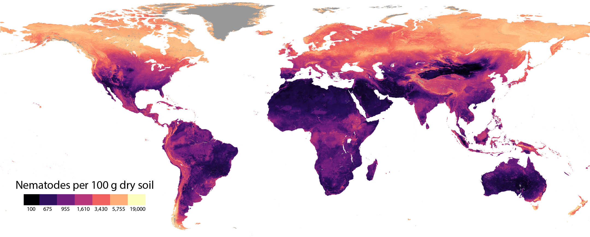

---
---

## Current
I am a scientist at the [Crowther Lab](https://www.crowtherlab.com/). On a daily basis, I help colleagues with global mapping projects, collect and process data, write papers, run the lab and make sure the coffee machine keeps working (purely out of own interest). My main interest is in soil microbiology, studying the function and activity of soil microbes in ecological processes, and carbon and nutrient cycling. To be able to say anything about the scale and significance of microbial contributions to global carbon and nutrient cycling, we need to know where all these microbes are located. So, we make maps. Like this one, showing the distribution patterns of [soil nematodes](https://www.nature.com/articles/s41586-019-1418-6), the most abundant animals on  Earth: 

 

My Google Scholar is [here](https://scholar.google.com/citations?user=0Pl8Q1EAAAAJ&hl=en).

### What I did before
I graduated from Wageningen University with a MSc in biotechnology in 2012, specializing in molecular biolgy. In 2018 I finished my PhD on cellular signaling in the potato late blight pathogen <i>Phytophthora infestans</i>, and explored the options to implement CRISPR/Cas9 for gene editing. My thesis is accessible via the [WUR library](https://library.wur.nl/WebQuery/wda/lang/2241772).

