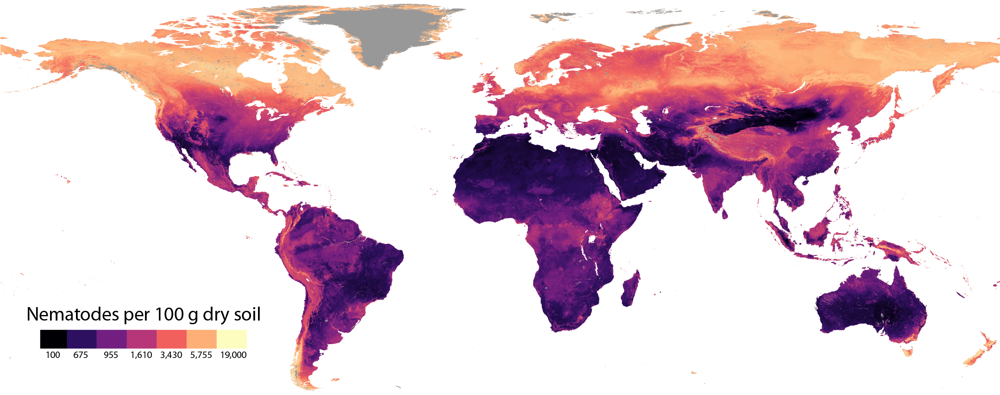

---
---

## Now 
I am a senior scientist at the [Crowther Lab](https://www.crowtherlab.com/). On a daily basis, I help colleagues with global mapping projects, collect and process data, write papers, run the lab and make sure the coffee machine keeps working (purely out of own interest). My interest is in soil microbiology, investigating the function and activity of soil microbes on ecological relevant processes such as carbon and nutrient cycling. However, before we can say anything about the scale and significance of microbial contributions to global carbon and nutrient cycling, we need to know where these microbes are located. So, we make maps. Like this one: 

 

My Google Scholar is [here](https://scholar.google.com/citations?user=0Pl8Q1EAAAAJ&hl=en).

## Before
I graduated from Wageningen University with a MSc in biotechnology in 2012, specializing in molecular biolgy. In 2018 I finished my PhD on cellular signaling in the potato late blight pathogen <i>Phytophthora infestans</i> in 2018. My thesis is accessible via the [WUR library](https://library.wur.nl/WebQuery/wda/lang/2241772).
